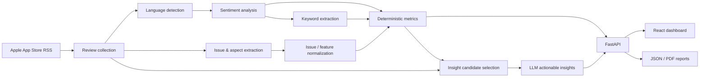

# Fieldnotes — App Store Review Intelligence

Fieldnotes is an end-to-end App Store review analysis system. It collects public reviews from Apple storefronts, runs multilingual NLP and LLM-based analysis, calculates reproducible metrics, surfaces recurring issues and feature requests, generates grounded product insights, and presents the results in a React dashboard.

A completed scan can be explored in the web interface or exported as raw reviews, a complete JSON analysis report, and a presentation-ready PDF report.

## What the project does

The pipeline combines four kinds of processing:

- **review collection** from one storefront or the most useful storefronts discovered for an app;
- **local NLP** for language identification, sentiment classification, and negative-review keyword extraction;
- **LLM-based semantic analysis** for aspects, concrete issues, feature requests, normalization, and actionable insights;
- **deterministic Python metrics** for counts, shares, averages, rating distributions, issue frequency, country/version breakdowns, and coverage.

The backend is a FastAPI application. The frontend is a React + TypeScript analytical workspace with rating and sentiment charts, aspect sentiment, issue frequency and impact views, feature requests, review filtering, scan history, and exportable reports.



---

## Approach and key design decisions

I treated this task as more than a review scraper. My goal was to build a small analysis system where collection, NLP, semantic interpretation, aggregation, and presentation are separate stages that can be inspected and replaced independently.

### Collecting reviews across storefronts

The first problem I ran into was that App Store reviews are storefront-specific. Looking at a single country can give a very narrow view of an application's feedback, so I implemented three collection modes:

- a single storefront;
- discovery across the supported storefronts;
- automatic collection from the highest-priority storefronts found during discovery.

The collector uses Apple's public RSS customer-review feeds. Reviews that appear in more than one storefront are deduplicated by review ID while preserving the storefronts where they were observed.

I also added a six-hour cache because this project is designed around one-off analyses rather than continuous monitoring. A local file cache works without any infrastructure; Upstash Redis can be enabled for shared remote caching.

Language identification is performed locally using the quantized fastText language-identification model.

### Keeping numerical metrics deterministic

One of the main design decisions was **not to ask an LLM to calculate statistics**.

Counts, percentages, rating distributions, averages, issue frequencies, feature-request frequencies, country/version breakdowns, and analysis coverage are calculated in Python from saved review IDs and model outputs.

I use language models only where semantic interpretation is actually useful. This keeps the numerical layer reproducible and prevents an LLM from silently changing a count, denominator, or percentage.

### Choosing the sentiment model

I did not want to pick a multilingual sentiment model only because it was popular or convenient, so I compared several candidates on a multilingual evaluation set with additional Ukrainian and English examples.

The candidates included:

- `cardiffnlp/twitter-xlm-roberta-base-sentiment`;
- `tabularisai/multilingual-sentiment-analysis`;
- `lxyuan/distilbert-base-multilingual-cased-sentiments-student`.

Cardiff XLM-RoBERTa gave the best overall result for the use case, especially on Ukrainian data and negative-review recall, so I kept it as the production sentiment model.

The full benchmark and limitations are documented in [`models_arena/sentiment/REPORT.md`](models_arena/sentiment/REPORT.md).

### Choosing the keyword extractor

I followed a similar process for negative-review keyword extraction. I compared:

- TF-IDF;
- multilingual MiniLM;
- `intfloat/multilingual-e5-small`;
- BGE-M3.

BGE-M3 and E5-small ended up very close in extraction quality, but E5-small was much faster on CPU and required less memory. I therefore selected multilingual E5-small for the final local pipeline.

I deliberately treat these extracted phrases as **supporting signals rather than confirmed product issues**. A phrase such as `subscription`, `too many ads`, or `slow search` can be useful evidence, but keyword extraction alone is not enough to understand what the user actually experienced.

The keyword experiments are documented in [`models_arena/keyword_extraction/`](models_arena/keyword_extraction/).

### Moving from keywords to structured issues

Sentiment plus keywords worked well for basic analysis, but it was not enough for mixed reviews.

A single review can praise the interface, complain about billing, mention a playback bug, and request a new feature at the same time. Because of that, I added an LLM-based aspect and issue extraction stage.

The extractor receives the **original review title and body**. It does not infer issues from the star rating and does not depend on keyword extraction.

For every relevant mention it can return:

- a broad product category;
- a specific aspect;
- aspect-level sentiment;
- a concrete issue;
- a feature request;
- evidence copied from the original review.

For this semantic stage I use `z-ai/glm-5.3-flash` through OpenRouter with structured JSON output and local schema validation.

I considered replacing the local sentiment and keyword models with a single all-LLM pipeline. For this version I decided against it: the local models are inexpensive, reproducible, and already evaluated, while the LLM is reserved for tasks where semantic understanding brings a clear benefit.

### Normalizing recurring problems

Another challenge is that users describe the same problem in many different ways:

- `Too many ads`
- `Ads appear too often`
- `There is way more advertising than before`

Treating every formulation as a separate issue would make the metrics almost useless.

Instead, the pipeline first collects unique raw issue descriptions and removes exact duplicates in Python. The first normalization pass works on bounded batches, with independent category/chunk requests running concurrently.

Because equivalent problems can still land in different batches, I added a final **global hierarchical reconciliation** step. It compares the provisional canonical groups again and merges semantic duplicates across earlier batch boundaries and, when justified, across broad categories. If the complete set does not fit into one request, reconciliation falls back to additional map-reduce rounds rather than treating the earlier batches as final.

The merge rule is intentionally conservative: a shared topic or causal relationship is not enough. Descriptions should refer to the same user-observed problem before they are merged. Python validates coverage, prevents invented IDs/categories, and creates stable canonical IDs only after reconciliation.

Feature requests are normalized separately so that a request for a new capability is not mixed with a bug in an existing feature.

More details are available in [`ISSUE_ANALYSIS.md`](ISSUE_ANALYSIS.md).

### Keeping larger scans responsive

A 50–100 review scan contains several independent workloads, so I avoid running the whole pipeline sequentially.

The local sentiment → keyword branch runs in parallel with LLM issue/aspect extraction. Issue extraction itself is split into bounded review batches and several requests can run concurrently. After extraction, issue normalization and feature-request normalization also run in parallel, while independent normalization chunks are processed concurrently before reconciliation.

OpenRouter provider routing is configurable through `OPENROUTER_PROVIDER_ORDER`; the default preference is `parasail,baseten,together` to avoid accidentally routing a scan through a very slow provider while still keeping fallbacks within a known provider set.

I also added hard request budgets. Extraction and insight calls use approximately a 25k input limit with a 25k output cap and 20k reasoning cap; normalization/reconciliation can use up to approximately 100k input with a 100k output cap and 80k reasoning cap. Oversized record sets are split instead of silently truncating reviews. These limits are mainly guardrails against pathological reasoning runs and unexpectedly high OpenRouter costs.

Analysis progress is persisted as weighted stage progress and exposed through the scan status API. The frontend polls it and shows the current stage, percentage, and processed-review count where applicable. A running scan can also be stopped; already persisted work remains available and the scan can later be resumed.

### Generating actionable insights

The final LLM stage does not receive the complete review dataset and then invent a report from scratch.

Python first selects recurring canonical issues using the metrics already calculated by the pipeline. For each selected issue it chooses representative original reviews. The number of examples scales with the number of reviews attached to that problem: approximately 10%, with a minimum of 5 and a maximum of 15 when enough reviews are available.

The model receives:

- the canonical issue;
- deterministic metrics;
- original representative reviews;
- extracted supporting evidence.

Its task is qualitative: explain the recurring pattern, describe the user impact, and suggest reasonable product, UX, QA, or investigation steps.

It is explicitly instructed **not to recalculate statistics, invent technical root causes, or present the collected sample as the whole user population**.

### API, interface, and reports

The FastAPI backend exposes collection, analysis status, metrics, insights, issues, review browsing, scan history, and downloads.

I built the frontend as an analytical workspace rather than a generic admin panel. It includes:

- live analysis progress with stop/resume support;
- rating and sentiment distributions;
- aspect-level sentiment;
- recurring issue frequency;
- issue frequency vs. rating impact;
- feature-request statistics;
- country, language, and app-version views;
- common negative keywords;
- searchable and filterable enriched reviews;
- actionable insights;
- history of previous scans.

Each completed scan can be exported in three forms:

1. **raw reviews JSON** — the original collected review dataset;
2. **full analysis JSON** — metrics, normalized issues, feature requests, insights, and enriched review records;
3. **PDF report** — a presentation-ready report containing the main charts, metrics, findings, and recommendations.

---

## Sample report — Spotify

The example below was produced from a **100-review Ukrainian storefront scan** of Spotify. The collected sample had an average rating of **3.53**, with **30% of reviews rated 1–2 stars**. The analysis successfully processed **100 of 100 reviews** and identified **30 canonical issues**.

Advertising was the dominant pain point in this sample: **36% of reviews mentioned ads**, with complaints focusing on excessive ad frequency, disruptive ad load, and long ad breaks. The largest single canonical issue, **“Too many ads,” appeared in 23% of reviews**. Other recurring problems included songs disappearing or becoming unavailable from libraries and playlists, as well as the perception that the free tier is overly restricted without a Premium subscription.

The generated insights therefore focus primarily on reducing and validating ad frequency, investigating content-availability problems, and improving the balance and communication of free-tier limitations. These findings describe only the collected App Store sample and should not be generalized to Spotify's full user population.

### Overview


### Recurring issues and impact


### Actionable insights


A full generated report is available here:

**[Download the Spotify sample PDF report](docs/sample-reports/spotify-analysis-report.pdf)**

---

## Run locally

### Requirements

- Python **3.11+**
- Node.js **20.19+** or a compatible newer release
- an OpenRouter API key for issue extraction, normalization, and insights

The complete local NLP pipeline also downloads the Cardiff sentiment and E5 keyword checkpoints on first use.

### 1. Clone and create a Python environment

```bash
git clone https://github.com/denisinside/appstore-reviews-analysis.git
cd appstore-reviews-analysis

python -m venv .venv
```

Activate it.

macOS/Linux:

```bash
source .venv/bin/activate
```

Windows PowerShell:

```powershell
.venv\Scripts\Activate.ps1
```

Install the backend and full NLP dependencies:

```bash
python -m pip install --upgrade pip
python -m pip install -r requirements.txt
python -m pip install -e ".[sentiment,keywords]"
```

### 2. Download the fastText language model

Create the model directory:

```bash
mkdir -p models
```

macOS/Linux:

```bash
curl -L https://dl.fbaipublicfiles.com/fasttext/supervised-models/lid.176.ftz \
  -o models/lid.176.ftz
```

Windows PowerShell:

```powershell
New-Item -ItemType Directory -Force models
Invoke-WebRequest `
  https://dl.fbaipublicfiles.com/fasttext/supervised-models/lid.176.ftz `
  -OutFile models/lid.176.ftz
```

The model is intentionally excluded from Git. If it is stored elsewhere, set `FASTTEXT_MODEL_PATH`.

### 3. Configure environment variables

Copy `.env.example` to `.env` and provide at least:

```dotenv
OPENROUTER_API_KEY=your-openrouter-key
FASTTEXT_MODEL_PATH=models/lid.176.ftz

APPSTORE_SCAN_DIR=scans
CORS_ORIGINS=http://localhost:5173,http://localhost:3000

# Optional provider preference. Leave empty to use OpenRouter automatic routing.
OPENROUTER_PROVIDER_ORDER=parasail,baseten,together
```

Optional shared caching:

```dotenv
UPSTASH_REDIS_REST_URL=https://your-database.upstash.io
UPSTASH_REDIS_REST_TOKEN=your-token
```

If both Upstash variables are absent, the backend uses the local file cache.

### 4. Install Chromium for PDF export

The PDF report endpoint uses Playwright:

```bash
playwright install chromium
```

If you only need the API/NLP pipeline and do not need server-side PDF export, this step can be skipped.

### 5. Start the API

```bash
uvicorn appstore_reviews.api:app --reload --port 8000 --env-file .env
```

Useful local URLs:

- API: `http://localhost:8000`
- Swagger/OpenAPI UI: `http://localhost:8000/docs`
- health check: `http://localhost:8000/health`

### 6. Start the frontend

In another terminal:

```bash
cd frontend
npm install
```

Create `frontend/.env`:

```dotenv
VITE_API_URL=http://localhost:8000
```

Start Vite:

```bash
npm run dev
```

Open:

```text
http://localhost:5173
```

The scan form accepts a numeric App Store ID, an `id...` value, or a complete App Store URL. The frontend extracts the numeric application ID before calling the API.

---

## REST API

The FastAPI application exposes the main workflow directly.

| Endpoint | Purpose |
| --- | --- |
| `GET /health` | Health check |
| `GET /api/scan-options` | Supported countries and scan limits for the frontend |
| `GET /api/apps/{app_id}/discovery` | Rank supported storefronts for an app |
| `POST /api/scans` | Collect reviews and create a scan |
| `GET /api/scans` | List saved scans, newest first |
| `GET /api/scans/{scan_id}` | Scan metadata, persisted progress, and analysis status |
| `POST /api/scans/{scan_id}/analyze` | Start or resume the NLP/LLM analysis pipeline |
| `POST /api/scans/{scan_id}/stop` | Request a graceful stop while preserving saved work |
| `GET /api/scans/{scan_id}/metrics` | Basic, sentiment, keyword, and NLP metrics |
| `GET /api/scans/{scan_id}/insights` | Generated actionable insights |
| `GET /api/scans/{scan_id}/issues` | Canonical issues and feature requests |
| `GET /api/scans/{scan_id}/reviews` | Paginated enriched reviews with filters |
| `GET /api/scans/{scan_id}/reviews/download` | Download raw review JSON |
| `GET /api/scans/{scan_id}/report/download` | Download the full analysis JSON |
| `GET /api/scans/{scan_id}/report/download.pdf` | Download the generated PDF report |

Swagger contains the current request and response schemas:

```text
http://localhost:8000/docs
```

---

## Deployment

The application is split into two independently deployable parts:

- **FastAPI + NLP pipeline — Modal**
- **React/Vite frontend — Vercel**

### Why Modal for the backend

The analysis pipeline is heavier than a typical serverless API route: it uses local Cardiff XLM-RoBERTa, multilingual E5, and fastText models in addition to OpenRouter calls.

The Modal image therefore downloads the pinned local model checkpoints **at image-build time**. They are reused by later containers instead of being downloaded on every cold start.

Analysis runs in a separate Modal worker with more CPU and memory than the web function. Saved scans are persisted in the `appstore-reviews-data` Modal Volume under `/data/scans`.

A simplified deployment flow is:

```bash
python -m pip install -e ".[deploy]"
modal setup
```

Create `.env.modal`:

```dotenv
OPENROUTER_API_KEY=your-key
OPENROUTER_PROVIDER_ORDER=parasail,baseten,together
UPSTASH_REDIS_REST_URL=your-upstash-rest-url
UPSTASH_REDIS_REST_TOKEN=your-upstash-token
CORS_ORIGINS=http://localhost:5173,https://your-frontend.vercel.app
FRONTEND_URL=https://your-frontend.vercel.app
```

Create/update the Modal secret:

```bash
modal secret create appstore-reviews-secrets --from-dotenv .env.modal --force
```

Temporary remote development:

```bash
modal serve modal_app.py
```

Persistent deployment:

```bash
modal deploy modal_app.py
```

After deployment, verify:

```text
https://<your-modal-api>/health
https://<your-modal-api>/docs
```

Then set the production frontend variable on Vercel:

```dotenv
VITE_API_URL=https://<your-modal-api>
```

and add the exact Vercel origin to `CORS_ORIGINS`.

The complete Modal setup, Volume behavior, and troubleshooting commands are documented in [`DEPLOY_MODAL.md`](DEPLOY_MODAL.md).

> **PDF export note:** server-side PDF generation uses Playwright/Chromium and loads the frontend report route. A production environment that exposes PDF export must include the Chromium browser/runtime dependencies and set the frontend URL appropriately.

---

## Review collection and caching notes

The collector currently supports a fixed set of 32 storefront countries and Apple RSS pages 1–10.

Apple's feeds expose only an accessible subset of reviews. The counts produced by this project are therefore **accessible collected reviews, not the application's total App Store review count**.

A review observed in several storefronts is counted once globally but keeps its `observed_countries` metadata.

Successful populated RSS pages and complete discovery results are cached for six hours. Valid empty pages use a shorter cache. Failed requests and partial discovery results are not stored as successful results.

`--force-refresh` can be used from the CLI when fresh RSS requests are needed.

---

## CLI and reusable Python package

The web application is the primary interface, but the collector and analysis modules can also be used independently.

Examples:

```bash
python -m appstore_reviews discovery --app-id 389801252
python -m appstore_reviews country --app-id 389801252 --country ua
python -m appstore_reviews top --app-id 389801252 --top 10
```

Run a saved review dataset through the complete analysis pipeline:

```bash
python -m appstore_reviews analyze \
  --input reviews.json \
  --output-dir scan/example \
  --max-cost-usd 1.00
```

Recalculate deterministic NLP metrics without new API calls:

```bash
python -m appstore_reviews recalculate-nlp-metrics \
  --output-dir scan/example
```

---

## Saved scan artifacts

A completed analysis persists its intermediate and final artifacts. Depending on the stage, a scan directory can contain:

```text
scan.json
collection.json
reviews.json
basic_metrics.json
sentiment_results.json
keyword_results.json
review_analyses.json
issue_catalog.json
feature_request_catalog.json
nlp_metrics.json
insights_input.json
insights.json
scan_state.json
normalization_cache/
```

Keeping intermediate artifacts is intentional. It makes the pipeline auditable, allows metrics to be recalculated without rerunning LLM calls, and allows interrupted scans to resume from already completed work.

---

## Limitations

There are several important limitations to keep in mind:

- Apple RSS provides only an accessible sample of reviews, not a complete historical dataset.
- Country, version, and time comparisons can be misleading when their sample sizes are small.
- Language identification is a best-effort prediction.
- Sentiment, keyword, issue, normalization, and insight outputs are model predictions and can be wrong.
- Exact evidence validation helps catch unsupported LLM quotations but does not prove that every semantic interpretation is correct.
- OpenRouter provider latency and availability can still vary even with an explicit preferred-provider order.
- User-reported behavior in reviews is evidence of user perception, not confirmation of a technical root cause.
- The Cardiff sentiment checkpoint currently does not declare a license on its model card, so commercial usage rights should be clarified before using that checkpoint in a commercial product.
- The current workflow is designed for one-off analysis, not continuous review monitoring.

---

## Tests

Backend tests:

```bash
python -m pytest -q
```

Frontend:

```bash
cd frontend
npm test
npm run build
```

The test suites cover collection behavior, sentiment/keyword utilities, issue extraction and normalization logic, deterministic metrics, API behavior, frontend parsing/data utilities, and regression cases added during development.

---

## Further documentation

- [`ISSUE_ANALYSIS.md`](ISSUE_ANALYSIS.md) — issue/aspect extraction, normalization, metrics, caching, and schema details
- [`models_arena/sentiment/REPORT.md`](models_arena/sentiment/REPORT.md) — sentiment model comparison
- [`models_arena/keyword_extraction/`](models_arena/keyword_extraction/) — keyword extraction experiments and reports
- [`frontend/README.md`](frontend/README.md) — frontend-specific setup
- [`DEPLOY_MODAL.md`](DEPLOY_MODAL.md) — Modal deployment instructions
